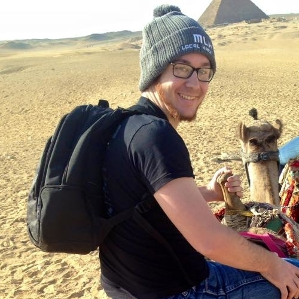

# Me! Nick Heindl

Welcome to my Me (:tm:) profile. Shouts to my friend [L O Z O R D](https://github.com/LOZORD/me) for the idea and inspiration.

I'm a fifth year undergrad at the University of Wisconsin-Madison, where I'm majoring in both [Computer Sciences](http://www.cs.wisc.edu/) :computer: and [Linguistics](http://ling.wisc.edu/) :tongue:, with a certificate/minor in game development :video_game: (I believe I'll be the first person with this too!).

Besides working on some personal projects and things for the [Undergrad Projects Lab](http://www.upl.cs.wisc.edu/), I'm currently contracting some work for AppleTV development with [Flippfly](http://flippfly.com/) while finishing up my degree. 

I also have a site [here](http://nheindl.com/), but I keep this repo more up-to-date. Updating this repo is just so much nicer, and allows me to throw stuff up faster without worrying about some of the cruft that can come with maintaining a traditional personal site (cough cough .css). Plus, it is github, so it is a lot easier to browse through projects :+1:

This is me on New Years Eve 2014/2015 in Egypt! :camel:

## Resume

### [Markdown Resume](resume.md) (Usually most up-to-date and has links!)

### [Recent-ish PDF](ResumeNickHeindl2016Spring.pdf)

## Personal Game stuff
* Wisconsin Game Dev Resources
* Monologue
* Twine
* AoE Map
* Minecraft Mod
* CAVE

## Projects and Talks
* [GitHub](http://github.com/katamaritaco?tab=repositories) - A lot of assorted projects are within [here](https://github.com/katamaritaco/Misc-Projects)
* Project Euler
* Working through [Nucl.ai's game ai course](http://courses.nucl.ai/)
* I love giving talks. You can find some [here](https://github.com/UW-UPL/Talks), and I've given other talks at Madison Indies Meetup. I'm going to try and record more in the future.

## Other Interests 

### Hackathons
I've learned a lot by attending numerous hackathons and even giving talks about them too! Here are some I've attended: BoilerMake, MHacks, hackMIT, HackTech, Facebook Midwest Hack, etc.

### Music
I love music. These days you can suualyl find me listening to rinse or sub. scratch

### Language
I'm currently working on two linguistic focused projects: an etymology of 'dank' and a list of linguistic resources. I'll update this more as they progress.

